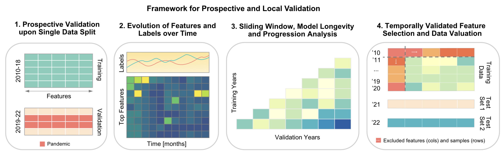

Diagnostic framework to validate clinical machine learning models locally on temporally stamped data
==============================

Abstract
--------------------
With the growing use of routinely collected clinical data, computational models are increasingly used to predict patient outcomes with the aim to improve care. However, changes in medical practices, technologies, and patient characteristics can lead to variability in the clinical data that is collected, reducing the accuracy of the results obtained when applying the computational model. We developed a framework to systematically evaluate clinical machine learning models over time that assesses how clinical data and computational model performance evolve. We used our model on people with cancer undergoing chemotherapy and were able to predict emergency department visits and hospitalizations. <br><br>


 <br><br>


The framework proceeds in 4 stages, i.e.
- Experiment 1: Prospective Validation upon Single Data Split
- Experiment 2: Evolution of Features and Labels over Time
- Experiment 3: Sliding Window, Model Longevity, and Progression Analysis
- Experiment 4: Temporally Validated Feature Selection and Data Validation


Project Organization
--------------------
    .
    ├── LICENSE
    ├── README.md
    ├── .gitignore
    ├── environment.yml
    ├── config
    │   ├── config.py
    │   └── install.R
    │  
    ├── data
    │   ├── featured_image
    │   ├── (processed)
    │   └── (raw)
    │  
    ├── results
    │   ├── figure_1
    │   ├── figure_2
    │   ├── figure_3
    │   ├── figure_4
    │   ├── figure_5
    │   └── figure_6
    └── src
        ├── experiments
        │   ├── experiment_1_and_3
        │   ├── experiment_2
        │   └── experiment_4
        ├── models
        ├── visualization
        └── tools


Cite us
--------------------
```
```


Prerequisites
--------------------
- R and RStudio (for visualization)
- Python and corresponding IDE (for model training and evaluation)
- Git/Github

Implementation of the Environment
--------------------
To run this project, proceed by performing the following steps.

1. Clone the repository by using the HTTPS or SSH version.
2. Open the Project in RStudio and/or an integrated development environment for Python.
3. We recommend creating a virtual environment using

```bash
conda env create -f environment.yml
conda activate env_temporal_ml
```

4. Install all necessary R packages from `install.R`. Ideally, create a new R project where the folder that contains this repository is selected as the root folder.


Running the Pipeline
--------------------
To implement this project, you first need to prepare the data inputs, which include
- A feature/design matrix: $X$ (`features.csv`)
- A outcome vector: $Y$ (`labels.csv`)
- Time stamps either stored in $X$ or $Y$ <br><br>

To implement the project:
1. Define the data paths to the features and labels. You can use the `config.py` file to store and access those data paths without hardcoding them.
2. Define time periods for which the prospective validation should be performed, based on a single time split. In this project the data were split into a training set for 2010-2018 and test set from 2019-2022.
3. Within `config/config.py`, locate the section for various configurations and parameters including for random seeds, number of permutations, imputation and adjust them as needed.
4. Run each experiment. Note that the experiments are independent so that each analysis can be implemented without using the output from another experiment.


Authors
--------------------
- Maximilian Schuessler (maxsc [at] stanford [dot] edu)
- Scott Fleming
- Shannon Meyer
- Tina Seto
- Tina Hernandez-Boussard


